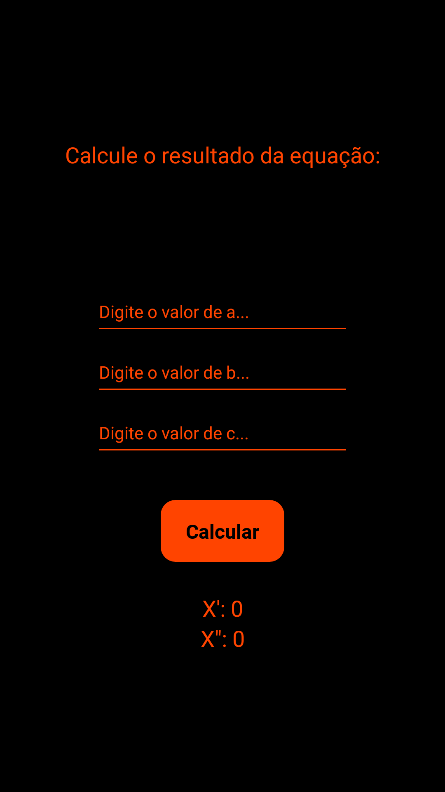
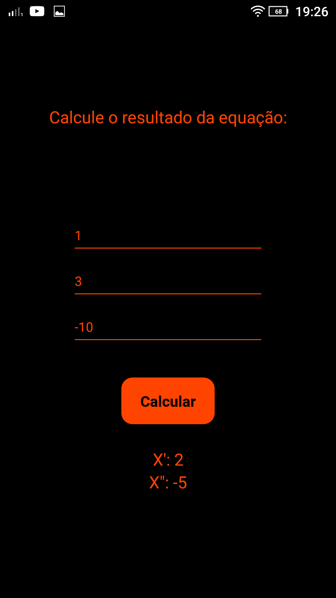

<p align="center">
  
</p>

# Bhaskara Calc
Uma calculadora que resolve equações de segundo grau para você.

## Capturas de Tela:
<p align="center">
  
  
</p>

## Começando:

Antes de começar a usar o projeto você vai precisar ter instalado:

- [Expo](https://docs.expo.io/get-started/installation/).
- E vai precisar ter instalado em seu dispositivo móvel (IOS ou Android) o app Expo.

## Rodando o projeto:

Para rodar o projeto você vai precisar:

```shell
cd "diretório de sua escolha"
git clone https://github.com/Clovis-Chakrian/Bhaskara-Calc
expo start
```
e agora você vai precisar abrir com o seu dispositivo móvel.

## O que é o Bhaskara Calc:

Bhaskara Calc é um aplicativo desenvolvido por mim, para resolver equações de segundo grau de forma rápida.

## Licença:

Esse projeto está sob a [Licença do MIT](LICENSE).

Feito com cuidado e carinho por [Clóvis Chakrian](https://github.com/Clovis-Chakrian).